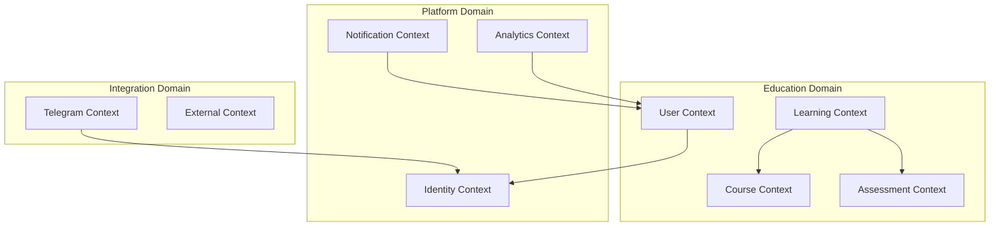

# 🏗️ Backend Architecture Specification
*Telegram iOS Academy Foundation Pro - Enterprise-Grade Educational Platform*

> **Version**: 2.0 | **Author**: Senior Tech Lead | **Last Updated**: 2025-09-19
> 
> *Основано на лучших практиках из DDIA, DDD, Microservices Patterns, Building Microservices, Release It!, Software Architecture: The Hard Parts, Database Internals, Team Topologies*

---

## 📋 Executive Summary

Наша платформа представляет собой **Event-Driven Microservices Architecture** на базе **Domain-Driven Design**, оптимизированную для **горизонтального масштабирования** и **высокой доступности**. Архитектура спроектирована для поддержки **миллионов пользователей** с минимальной латентностью и максимальной отказоустойчивостью.

### 🎯 Architectural Principles

1. **Domain-Driven Design** - Четкое разделение bounded contexts
2. **Event Sourcing** - Полная трассируемость изменений
3. **CQRS** - Разделение команд и запросов
4. **Microservices** - Автономные, независимо деплоящиеся сервисы
5. **API-First** - Contract-driven development
6. **Cloud-Native** - Containerized, orchestrated, observable

---

## 🏢 Domain Architecture (DDD)

### Core Bounded Contexts



### 1. User Context 👤
**Aggregate Root**: User
**Responsibilities**: Profile management, preferences, streak tracking
**Events**: UserRegistered, ProfileUpdated, StreakMaintained

### 2. Course Context 📚
**Aggregate Root**: Course
**Responsibilities**: Course structure, lesson ordering, prerequisites
**Events**: CourseCreated, LessonAdded, PrerequisiteUpdated

### 3. Learning Context 🎓
**Aggregate Root**: LearningPath
**Responsibilities**: Progress tracking, completion status, time tracking
**Events**: LessonStarted, LessonCompleted, ProgressUpdated

### 4. Assessment Context 📝
**Aggregate Root**: Assessment
**Responsibilities**: Quiz logic, scoring, attempts, interview simulations
**Events**: AssessmentStarted, AnswerSubmitted, AssessmentCompleted

---

## 🚀 Microservices Architecture

### Service Decomposition Strategy

```yaml
# Service Catalog
services:
  user-service:
    domain: User Context
    database: PostgreSQL (Write) + Redis (Cache)
    api: REST + GraphQL
    events: [UserRegistered, ProfileUpdated]
    
  course-service:
    domain: Course Context  
    database: PostgreSQL + Elasticsearch (Search)
    api: REST + GraphQL
    events: [CourseCreated, LessonAdded]
    
  learning-service:
    domain: Learning Context
    database: PostgreSQL + Time-Series DB
    api: REST + WebSocket
    events: [ProgressUpdated, LessonCompleted]
    
  assessment-service:
    domain: Assessment Context
    database: PostgreSQL + MongoDB (Flexible Schema)
    api: REST + Real-time
    events: [AssessmentCompleted, ScoreCalculated]
    
  notification-service:
    domain: Notification Context
    database: Redis + Message Queue
    api: Internal + Push Notifications
    events: [NotificationSent, ReminderScheduled]
    
  analytics-service:
    domain: Analytics Context
    database: ClickHouse + Apache Kafka
    api: Internal + Reporting
    events: [EventTracked, ReportGenerated]
    
  telegram-gateway:
    domain: Integration Context
    database: Redis (Session)
    api: Telegram Bot API + WebApp
    events: [TelegramMessageReceived, WebAppLaunched]
```

### Inter-Service Communication

**Synchronous Communication:**
- **REST APIs** для request-response операций
- **GraphQL Federation** для комплексных запросов
- **Circuit Breakers** с Hystrix pattern

**Asynchronous Communication:**
- **Apache Kafka** для event streaming
- **Redis Pub/Sub** для real-time notifications
- **Message Queues** (BullMQ) для job processing

---

## 🗄️ Database Architecture

### Polyglot Persistence Strategy

```sql
-- Primary Write Database (PostgreSQL)
-- ACID compliance, complex relationships
CREATE TABLE users (
    id UUID PRIMARY KEY DEFAULT gen_random_uuid(),
    telegram_id BIGINT UNIQUE NOT NULL,
    profile JSONB NOT NULL,
    preferences JSONB DEFAULT '{}',
    created_at TIMESTAMPTZ DEFAULT NOW(),
    updated_at TIMESTAMPTZ DEFAULT NOW(),
    version INTEGER DEFAULT 1 -- Optimistic locking
);

-- Event Store (PostgreSQL)
-- Event Sourcing implementation
CREATE TABLE event_store (
    event_id UUID PRIMARY KEY DEFAULT gen_random_uuid(),
    aggregate_id UUID NOT NULL,
    aggregate_type VARCHAR(100) NOT NULL,
    event_type VARCHAR(100) NOT NULL,
    event_data JSONB NOT NULL,
    event_version INTEGER NOT NULL,
    created_at TIMESTAMPTZ DEFAULT NOW(),
    UNIQUE(aggregate_id, event_version)
);

-- Read Models (Denormalized)
CREATE MATERIALIZED VIEW user_progress_summary AS
SELECT 
    user_id,
    COUNT(*) as total_lessons,
    COUNT(*) FILTER (WHERE completed = true) as completed_lessons,
    AVG(score) as average_score,
    SUM(time_spent_minutes) as total_time_spent
FROM learning_progress 
GROUP BY user_id;
```

### Caching Strategy

**L1 Cache (Application Level):**
- **In-Memory Cache** с TTL для frequent queries
- **Redis** для shared state между instances

**L2 Cache (Database Level):**
- **PostgreSQL Query Cache**
- **Materialized Views** для complex aggregations

**L3 Cache (CDN Level):**
- **CloudFlare** для static assets
- **API Response Caching** для immutable data

### Data Consistency Patterns

**Eventual Consistency:**
- Event-driven updates между bounded contexts
- Saga Pattern для distributed transactions
- Compensation actions для rollback

**Strong Consistency:**
- ACID transactions внутри bounded context
- Optimistic locking для concurrent updates
- Database constraints для data integrity

---

## 🔄 Event-Driven Architecture

### Event Sourcing Implementation

```typescript
// Event Store Interface
interface EventStore {
  append(streamId: string, events: DomainEvent[]): Promise<void>
  getEvents(streamId: string, fromVersion?: number): Promise<DomainEvent[]>
  getSnapshot(aggregateId: string): Promise<Snapshot | null>
  saveSnapshot(snapshot: Snapshot): Promise<void>
}

// Domain Event Base
abstract class DomainEvent {
  constructor(
    public readonly aggregateId: string,
    public readonly eventId: string = uuid(),
    public readonly occurredOn: Date = new Date(),
    public readonly eventVersion: number
  ) {}
}

// Example Events
class UserRegistered extends DomainEvent {
  constructor(
    aggregateId: string,
    public readonly telegramId: number,
    public readonly profile: UserProfile,
    eventVersion: number
  ) {
    super(aggregateId, undefined, undefined, eventVersion)
  }
}

class LessonCompleted extends DomainEvent {
  constructor(
    aggregateId: string,
    public readonly lessonId: string,
    public readonly score: number,
    public readonly timeSpent: number,
    eventVersion: number
  ) {
    super(aggregateId, undefined, undefined, eventVersion)
  }
}
```

### Event Processing Patterns

**Command Handler → Event Store → Event Projections → Read Models**

```typescript
// Command Handler
@CommandHandler(CompleteLesson)
export class CompleteLessonHandler {
  async execute(command: CompleteLesson): Promise<void> {
    const user = await this.userRepository.getById(command.userId)
    const lesson = await this.lessonRepository.getById(command.lessonId)
    
    user.completeLesson(lesson, command.score, command.timeSpent)
    
    await this.userRepository.save(user)
    // Events автоматически публикуются
  }
}

// Event Projection
@EventsHandler(LessonCompleted)
export class LessonCompletedProjection {
  async handle(event: LessonCompleted): Promise<void> {
    // Update read model
    await this.progressRepository.updateProgress({
      userId: event.aggregateId,
      lessonId: event.lessonId,
      score: event.score,
      timeSpent: event.timeSpent,
      completedAt: event.occurredOn
    })
    
    // Trigger notifications
    await this.notificationService.sendCompletionNotification(event)
  }
}
```

---

## 🌐 API Design & Governance

### RESTful API Standards

**Resource Naming:**
```
GET    /api/v2/users/{id}/courses           # User's courses
POST   /api/v2/users/{id}/courses/{courseId}/enroll
PUT    /api/v2/courses/{id}/lessons/{lessonId}/progress
DELETE /api/v2/users/{id}/notifications/{notificationId}
```

**Response Format:**
```json
{
  "data": { /* Actual response data */ },
  "meta": {
    "requestId": "req_12345",
    "timestamp": "2025-09-19T10:30:00Z",
    "version": "v2.1.0"
  },
  "pagination": {
    "page": 1,
    "limit": 20,
    "total": 150,
    "hasNext": true
  }
}
```

### GraphQL Federation

```graphql
# User Service Schema
type User @key(fields: "id") {
  id: ID!
  telegramId: String!
  profile: UserProfile!
  courses: [Course!]! @requires(fields: "id")
}

# Course Service Schema  
type Course @key(fields: "id") {
  id: ID!
  title: String!
  lessons: [Lesson!]!
  enrolledUsers: [User!]! @requires(fields: "id")
}

# Federated Gateway
type Query {
  user(id: ID!): User
  course(id: ID!): Course
  userProgress(userId: ID!, courseId: ID!): Progress
}
```

### API Versioning Strategy

- **URL Versioning** для major breaking changes (`/api/v2/`)
- **Header Versioning** для minor changes (`API-Version: 2.1`)
- **Content Negotiation** для response format (`Accept: application/vnd.api+json;version=2`)

---

## 🔒 Security Architecture

### Defense in Depth

**Layer 1: Network Security**
- **WAF** (Web Application Firewall)
- **DDoS Protection** via CloudFlare
- **VPN Access** для internal services

**Layer 2: API Gateway Security**
- **Rate Limiting** (Sliding Window)
- **Authentication** (Telegram WebApp validation)
- **Authorization** (RBAC + ABAC)
- **Input Validation** (JSON Schema)

**Layer 3: Application Security**
- **OWASP Top 10** protection
- **SQL Injection** prevention (Parameterized queries)
- **XSS Protection** (CSP headers)
- **CSRF Protection** (SameSite cookies)

**Layer 4: Data Security**
- **Encryption at Rest** (AES-256)
- **Encryption in Transit** (TLS 1.3)
- **Field-level Encryption** для sensitive data
- **Data Masking** в logs

### Security Implementation

```typescript
// JWT Token Validation
@Injectable()
export class TelegramAuthGuard implements CanActivate {
  canActivate(context: ExecutionContext): boolean {
    const request = context.switchToHttp().getRequest()
    const initData = request.headers['x-telegram-init-data']
    
    // Validate Telegram WebApp initData
    return this.telegramService.validateInitData(initData)
  }
}

// Rate Limiting
@Throttle({ default: { limit: 100, ttl: 60000 } })
@Controller('api/v2/lessons')
export class LessonController {
  
  @Throttle({ default: { limit: 10, ttl: 60000 } })
  @Post(':id/complete')
  async completeLesson() {
    // Protected endpoint
  }
}
```

---

## 📊 Observability & Monitoring

### Three Pillars of Observability

**1. Metrics (Prometheus + Grafana)**
```typescript
// Custom Metrics
@Injectable()
export class MetricsService {
  private readonly lessonCompletionCounter = new Counter({
    name: 'lesson_completions_total',
    help: 'Total number of lesson completions',
    labelNames: ['lesson_id', 'difficulty', 'user_type']
  })
  
  private readonly lessonCompletionDuration = new Histogram({
    name: 'lesson_completion_duration_seconds',
    help: 'Time taken to complete lessons',
    buckets: [30, 60, 120, 300, 600, 1800] // seconds
  })
}
```

**2. Logging (Structured Logging)**
```typescript
// Structured Logging
const logger = winston.createLogger({
  format: winston.format.combine(
    winston.format.timestamp(),
    winston.format.errors({ stack: true }),
    winston.format.json()
  ),
  defaultMeta: {
    service: 'learning-service',
    version: process.env.APP_VERSION
  }
})

// Usage
logger.info('Lesson completed', {
  userId: user.id,
  lessonId: lesson.id,
  score: completionData.score,
  timeSpent: completionData.timeSpent,
  traceId: request.traceId
})
```

**3. Tracing (Distributed Tracing)**
```typescript
// OpenTelemetry Integration
import { trace } from '@opentelemetry/api'

@Injectable()
export class LearningService {
  async completeLesson(userId: string, lessonId: string): Promise<void> {
    const span = trace.getActiveSpan()
    span?.setAttributes({
      'user.id': userId,
      'lesson.id': lessonId,
      'operation': 'complete_lesson'
    })
    
    try {
      // Business logic
      span?.setStatus({ code: SpanStatusCode.OK })
    } catch (error) {
      span?.recordException(error)
      span?.setStatus({ code: SpanStatusCode.ERROR })
      throw error
    }
  }
}
```

### Alerting Strategy

**SLI/SLO Definition:**
```yaml
availability_slo: 99.9%  # Max 8.77 hours downtime/year
latency_slo: 95% of requests < 200ms
error_rate_slo: < 0.1% error rate
throughput_slo: Handle 10k concurrent users

alerts:
  - name: high_error_rate
    condition: error_rate > 1% for 5 minutes
    severity: critical
    
  - name: high_latency  
    condition: p95_latency > 500ms for 5 minutes
    severity: warning
    
  - name: database_connection_pool_exhausted
    condition: active_connections > 90% for 2 minutes
    severity: critical
```

---

## ⚡ Performance & Scalability

### Horizontal Scaling Strategy

**Auto-Scaling Configuration:**
```yaml
# Kubernetes HPA
apiVersion: autoscaling/v2
kind: HorizontalPodAutoscaler
metadata:
  name: learning-service-hpa
spec:
  scaleTargetRef:
    apiVersion: apps/v1
    kind: Deployment
    name: learning-service
  minReplicas: 3
  maxReplicas: 50
  metrics:
  - type: Resource
    resource:
      name: cpu
      target:
        type: Utilization
        averageUtilization: 70
  - type: Resource
    resource:
      name: memory
      target:
        type: Utilization
        averageUtilization: 80
```

### Database Scaling

**Read Replicas:**
- **Master-Slave** репликация для read operations
- **Connection Pooling** с PgBouncer
- **Query Optimization** с pg_stat_statements

**Sharding Strategy:**
```sql
-- Partition by user_id hash
CREATE TABLE learning_progress (
    user_id UUID,
    lesson_id UUID,
    score DECIMAL(5,4),
    completed_at TIMESTAMPTZ,
    PRIMARY KEY (user_id, lesson_id)
) PARTITION BY HASH (user_id);

-- Create partitions
CREATE TABLE learning_progress_0 PARTITION OF learning_progress
    FOR VALUES WITH (MODULUS 4, REMAINDER 0);
```

### Caching Architecture

**Multi-Level Caching:**
```typescript
// L1: Application Cache
@Injectable()
export class CacheService {
  private memoryCache = new Map<string, CacheEntry>()
  
  // L2: Redis Distributed Cache
  async get<T>(key: string): Promise<T | null> {
    // Try L1 first
    const memoryResult = this.memoryCache.get(key)
    if (memoryResult && !memoryResult.isExpired()) {
      return memoryResult.value
    }
    
    // Fallback to L2
    const redisResult = await this.redis.get(key)
    if (redisResult) {
      const parsed = JSON.parse(redisResult)
      this.memoryCache.set(key, new CacheEntry(parsed, Date.now() + 60000))
      return parsed
    }
    
    return null
  }
}
```

---

## 🚢 Deployment & DevOps

### CI/CD Pipeline

```yaml
# .github/workflows/deploy.yml
name: Production Deployment

on:
  push:
    branches: [main]

jobs:
  test:
    runs-on: ubuntu-latest
    steps:
      - uses: actions/checkout@v4
      - name: Run Tests
        run: |
          npm ci
          npm run test:unit
          npm run test:e2e
          npm run test:security
  
  build:
    needs: test
    runs-on: ubuntu-latest
    steps:
      - name: Build Docker Images
        run: |
          docker build -t $IMAGE_TAG .
          docker push $REGISTRY/$IMAGE_TAG
  
  deploy:
    needs: build
    runs-on: ubuntu-latest
    steps:
      - name: Blue-Green Deployment
        run: |
          kubectl apply -f k8s/
          kubectl rollout status deployment/api-service
          kubectl rollout status deployment/learning-service
```

### Infrastructure as Code

**Terraform Configuration:**
```hcl
# infrastructure/main.tf
module "postgresql" {
  source = "./modules/postgresql"
  
  instance_class = "db.r6g.2xlarge"
  allocated_storage = 1000
  max_allocated_storage = 10000
  backup_retention_period = 30
  
  replica_count = 2
  monitoring_enabled = true
}

module "redis_cluster" {
  source = "./modules/redis"
  
  node_type = "cache.r6g.xlarge"
  num_cache_nodes = 3
  parameter_group_name = "default.redis7"
}

module "kubernetes" {
  source = "./modules/eks"
  
  cluster_version = "1.28"
  node_groups = {
    api_services = {
      instance_types = ["c6i.2xlarge"]
      min_size = 3
      max_size = 50
      desired_size = 6
    }
  }
}
```

### Disaster Recovery

**RTO/RPO Targets:**
- **RTO** (Recovery Time Objective): 15 minutes
- **RPO** (Recovery Point Objective): 5 minutes max data loss

**Backup Strategy:**
```bash
# Database Backups
# Full backup daily at 2 AM UTC
0 2 * * * pg_dump $DATABASE_URL | gzip > /backups/full_$(date +%Y%m%d).sql.gz

# Point-in-time recovery enabled
# Transaction log backups every 5 minutes
*/5 * * * * pg_receivexlog -D /backups/wal/

# Cross-region replication
# Async replica in different AWS region
```

---

## 📈 Capacity Planning

### Growth Projections

**Year 1 Targets:**
- **Users**: 100K registered, 10K DAU
- **Lessons**: 500 lessons completed per day
- **API Requests**: 1M requests per day
- **Database**: 10GB data storage

**Year 3 Targets:**
- **Users**: 1M registered, 100K DAU  
- **Lessons**: 50K lessons completed per day
- **API Requests**: 100M requests per day
- **Database**: 1TB data storage

### Resource Requirements

**Database Sizing:**
```sql
-- Estimated storage per user per year
-- User profile: ~1KB
-- Learning progress: ~100 lessons × 500 bytes = 50KB  
-- Event store: ~1000 events × 1KB = 1MB
-- Total per user: ~1.05MB

-- For 1M users: ~1TB storage needed
-- Plus 40% buffer: ~1.4TB
-- Plus indexes (30%): ~1.8TB total
```

**API Service Sizing:**
```yaml
# Resource requests per service instance
resources:
  requests:
    cpu: 100m      # 0.1 CPU cores
    memory: 256Mi  # 256 MB RAM
  limits:
    cpu: 500m      # 0.5 CPU cores  
    memory: 512Mi  # 512 MB RAM

# Estimated for 10K concurrent users
# 20 instances × 0.5 CPU = 10 CPU cores
# 20 instances × 512MB = 10GB RAM
```

---

## 🎯 Quality Attributes

### Availability: 99.9%
- **Load Balancing** с health checks
- **Circuit Breakers** для fault tolerance
- **Graceful Degradation** при partial failures
- **Multi-AZ Deployment** для geo-redundancy

### Performance: <200ms p95
- **Connection Pooling** для database
- **CDN** для static assets  
- **Async Processing** для heavy operations
- **Lazy Loading** для UI components

### Scalability: 100K concurrent users
- **Stateless Services** для horizontal scaling
- **Database Sharding** по user_id
- **Event-Driven Architecture** для loose coupling
- **Microservices** для independent scaling

### Security: Enterprise-Grade
- **Zero Trust Architecture**
- **End-to-End Encryption**
- **Regular Security Audits**
- **GDPR/CCPA Compliance**

---

## 🔮 Future Architecture Evolution

### Phase 1: Enhanced Real-time (Q1 2025)
- WebSocket connections для live collaboration
- Server-Sent Events для notifications
- Real-time leaderboards и progress sharing

### Phase 2: AI/ML Integration (Q2 2025)
- Personalized learning paths с ML recommendations
- Adaptive testing с difficulty adjustment
- Content generation с LLM integration

### Phase 3: Global Scale (Q3 2025)
- Multi-region deployment
- Edge computing для latency reduction
- Advanced caching strategies

### Phase 4: Platform Ecosystem (Q4 2025)
- Third-party integrations API
- Plugin architecture
- Marketplace для community content

---

## 📚 Technology Radar

### Adopt ✅
- **NestJS** (Production-ready framework)
- **PostgreSQL** (ACID compliance, JSON support)
- **Redis** (Caching, sessions, queues)
- **Docker + Kubernetes** (Containerization)
- **Prometheus + Grafana** (Monitoring)

### Trial 🧪  
- **Event Store DB** (Purpose-built event store)
- **Apache Kafka** (Event streaming platform)
- **GraphQL Federation** (Distributed graph)
- **Istio Service Mesh** (Advanced networking)

### Assess 👀
- **Temporal** (Workflow orchestration)
- **CockroachDB** (Global distributed SQL)
- **Pulumi** (Infrastructure as Code)
- **Dapr** (Distributed application runtime)

### Hold ⏸️
- **MongoDB** (Consistency concerns)
- **Microservices без Event Sourcing** (Data consistency issues)
- **Manual deployment processes** (Error-prone)

---

## 🤝 Team Topology

### Service Ownership Model

**Stream-Aligned Teams:**
- **User Experience Team** (Frontend + User Service)
- **Learning Platform Team** (Course + Learning + Assessment Services)  
- **Platform Team** (Infrastructure + DevOps + Observability)
- **Data Team** (Analytics + ML + Reporting)

**Enabling Teams:**
- **Security Team** (Security standards, audits)
- **QA Team** (Testing frameworks, automation)

**Complicated Subsystem Teams:**
- **Data Platform Team** (BigData infrastructure)

### Interaction Modes:
- **Collaboration**: During new feature development
- **X-as-a-Service**: Platform services consumption  
- **Facilitating**: Knowledge sharing, standards

---

*"Architecture is about the important stuff, whatever that is." - Ralph Johnson*

**This document serves as our north star for backend development. It balances current needs with future scalability, ensuring we can grow from thousands to millions of users without architectural rewrites.**

---

*🔗 Related Documents:*
- [API Documentation](./API_DOCUMENTATION.md)
- [Database Schema](./DATABASE_SCHEMA.md) 
- [Security Playbook](./SECURITY_PLAYBOOK.md)
- [Monitoring Runbook](./MONITORING_RUNBOOK.md)
- [Incident Response Guide](./INCIDENT_RESPONSE.md)