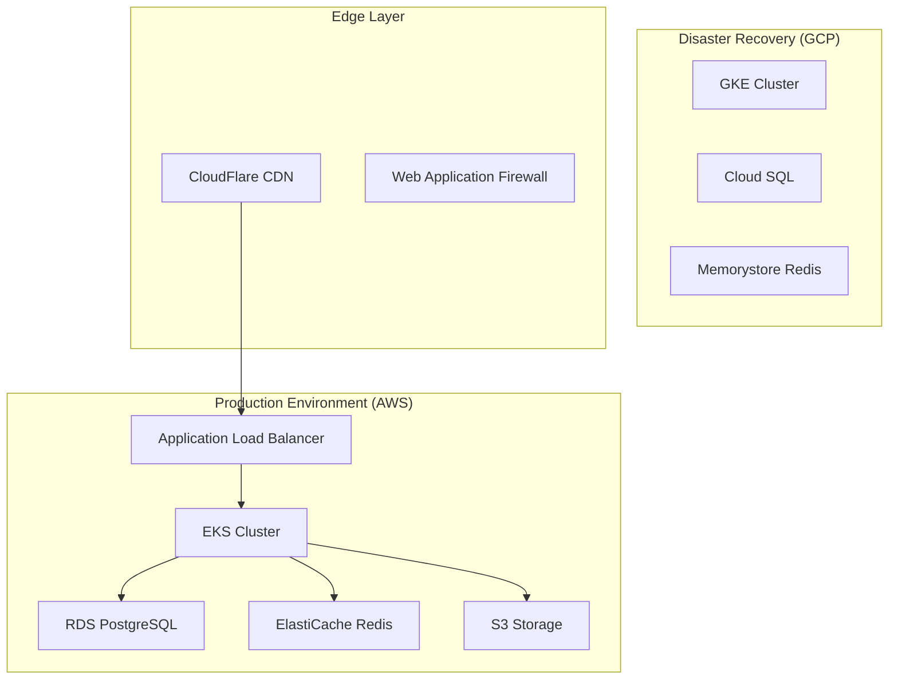

# 🚀 DevOps Playbook
*Telegram iOS Academy Foundation Pro - Production Operations Guide*

> **Version**: 2.0 | **Author**: Senior DevOps Engineer | **Last Updated**: 2025-09-19
> 
> *Основано на принципах из "Release It!", "Accelerate", "The Phoenix Project", "Site Reliability Engineering"*

---

## 📋 Executive Summary

Этот playbook описывает **production-ready DevOps практики** для масштабируемой образовательной платформы. Наша цель - достичь **elite performance** по метрикам DORA: deployment frequency (несколько раз в день), lead time (< 1 час), MTTR (< 15 минут), change failure rate (< 5%).

---

## 🏗️ Infrastructure Architecture

### Cloud Provider Strategy

**Multi-Cloud Approach:**
- **Primary**: AWS (Production workloads)
- **Secondary**: Google Cloud (DR + Analytics)
- **Edge**: CloudFlare (CDN + Security)
- **Development**: Railway (Rapid prototyping)



### Kubernetes Configuration

**Production Cluster Setup:**
```yaml
# cluster-config.yaml
apiVersion: eksctl.io/v1alpha5
kind: ClusterConfig

metadata:
  name: telegram-academy-prod
  region: us-east-1
  version: "1.28"

iam:
  withOIDC: true
  serviceAccounts:
  - metadata:
      name: aws-load-balancer-controller
      namespace: kube-system
    wellKnownPolicies:
      awsLoadBalancerController: true

nodeGroups:
  - name: api-services
    instanceType: c6i.2xlarge
    minSize: 3
    maxSize: 50
    desiredCapacity: 6
    volumeSize: 100
    volumeType: gp3
    labels:
      workload-type: api
    taints:
      dedicated: api:NoSchedule
    
  - name: background-jobs
    instanceType: r6i.xlarge
    minSize: 2
    maxSize: 20
    desiredCapacity: 4
    labels:
      workload-type: jobs
    taints:
      dedicated: jobs:NoSchedule

addons:
  - name: vpc-cni
    version: latest
  - name: coredns
    version: latest
  - name: kube-proxy
    version: latest
  - name: aws-ebs-csi-driver
    version: latest
```

### Network Architecture

**VPC Setup:**
```terraform
# network.tf
resource "aws_vpc" "main" {
  cidr_block           = "10.0.0.0/16"
  enable_dns_hostnames = true
  enable_dns_support   = true
  
  tags = {
    Name = "telegram-academy-vpc"
    Environment = "production"
  }
}

resource "aws_subnet" "private" {
  count             = 3
  vpc_id            = aws_vpc.main.id
  cidr_block        = "10.0.${count.index + 1}.0/24"
  availability_zone = data.aws_availability_zones.available.names[count.index]
  
  tags = {
    Name = "private-subnet-${count.index + 1}"
    kubernetes.io/role/internal-elb = "1"
  }
}

resource "aws_subnet" "public" {
  count                   = 3
  vpc_id                  = aws_vpc.main.id
  cidr_block              = "10.0.${count.index + 10}.0/24"
  availability_zone       = data.aws_availability_zones.available.names[count.index]
  map_public_ip_on_launch = true
  
  tags = {
    Name = "public-subnet-${count.index + 1}"
    kubernetes.io/role/elb = "1"
  }
}
```

---

## 🔄 CI/CD Pipeline

### GitOps Workflow

**Branch Strategy:**
```
main (production)
├── develop (staging)
├── feature/user-auth
├── feature/lesson-engine
└── hotfix/critical-bug
```

**GitHub Actions Pipeline:**
```yaml
# .github/workflows/production.yml
name: Production Deployment

on:
  push:
    branches: [main]
  
env:
  REGISTRY: ghcr.io
  IMAGE_NAME: ${{ github.repository }}

jobs:
  quality-gates:
    runs-on: ubuntu-latest
    strategy:
      matrix:
        service: [api, bot, web]
    steps:
      - name: Checkout
        uses: actions/checkout@v4
        
      - name: Setup Node.js
        uses: actions/setup-node@v4
        with:
          node-version: '20'
          cache: 'pnpm'
          
      - name: Install dependencies
        run: pnpm install --frozen-lockfile
        
      - name: Type checking
        run: pnpm run type-check:${{ matrix.service }}
        
      - name: Linting
        run: pnpm run lint:${{ matrix.service }}
        
      - name: Unit tests
        run: pnpm run test:unit:${{ matrix.service }}
        
      - name: Security scan
        uses: securecodewarrior/github-action-add-sarif@v1
        with:
          sarif-file: security-scan-results.sarif

  integration-tests:
    needs: quality-gates
    runs-on: ubuntu-latest
    services:
      postgres:
        image: postgres:15
        env:
          POSTGRES_PASSWORD: test
        options: >-
          --health-cmd pg_isready
          --health-interval 10s
          --health-timeout 5s
          --health-retries 5
      redis:
        image: redis:7
        options: >-
          --health-cmd "redis-cli ping"
          --health-interval 10s
          --health-timeout 5s
          --health-retries 5
    steps:
      - name: Integration tests
        run: pnpm run test:integration
        
      - name: E2E tests
        uses: cypress-io/github-action@v6
        with:
          start: pnpm run start:test
          wait-on: 'http://localhost:3000'
          browser: chrome

  build-and-push:
    needs: integration-tests
    runs-on: ubuntu-latest
    outputs:
      image-digest: ${{ steps.build.outputs.digest }}
    steps:
      - name: Build and push Docker image
        id: build
        uses: docker/build-push-action@v5
        with:
          context: .
          platforms: linux/amd64,linux/arm64
          push: true
          tags: |
            ${{ env.REGISTRY }}/${{ env.IMAGE_NAME }}:latest
            ${{ env.REGISTRY }}/${{ env.IMAGE_NAME }}:${{ github.sha }}
          cache-from: type=gha
          cache-to: type=gha,mode=max

  deploy-staging:
    needs: build-and-push
    runs-on: ubuntu-latest
    environment: staging
    steps:
      - name: Deploy to staging
        uses: azure/k8s-deploy@v1
        with:
          manifests: |
            k8s/staging/
          images: |
            ${{ env.REGISTRY }}/${{ env.IMAGE_NAME }}:${{ github.sha }}
            
      - name: Run smoke tests
        run: |
          curl -f https://staging.academy.example.com/health
          pnpm run test:smoke:staging

  deploy-production:
    needs: [build-and-push, deploy-staging]
    runs-on: ubuntu-latest
    environment: production
    if: github.ref == 'refs/heads/main'
    steps:
      - name: Blue-Green Deployment
        uses: ./actions/blue-green-deploy
        with:
          image: ${{ env.REGISTRY }}/${{ env.IMAGE_NAME }}:${{ github.sha }}
          namespace: production
          
      - name: Health check
        run: |
          # Wait for deployment to be ready
          kubectl rollout status deployment/api-service -n production
          kubectl rollout status deployment/web-service -n production
          
          # Run health checks
          curl -f https://api.academy.example.com/health
          
      - name: Notify Slack
        uses: 8398a7/action-slack@v3
        with:
          status: ${{ job.status }}
          channel: '#deployments'
          webhook_url: ${{ secrets.SLACK_WEBHOOK }}
```

### Blue-Green Deployment Strategy

```yaml
# blue-green-deployment.yaml
apiVersion: argoproj.io/v1alpha1
kind: Rollout
metadata:
  name: api-service
spec:
  replicas: 6
  strategy:
    blueGreen:
      activeService: api-service
      previewService: api-service-preview
      autoPromotionEnabled: false
      prePromotionAnalysis:
        templates:
        - templateName: success-rate
        args:
        - name: service-name
          value: api-service-preview
      postPromotionAnalysis:
        templates:
        - templateName: success-rate
        args:
        - name: service-name
          value: api-service
      promotionPolicy:
        timeoutSeconds: 300
      scaleDownDelaySeconds: 30
      previewReplicaCount: 3
  selector:
    matchLabels:
      app: api-service
  template:
    metadata:
      labels:
        app: api-service
    spec:
      containers:
      - name: api
        image: ghcr.io/telegram-academy/api:latest
        ports:
        - containerPort: 3000
        resources:
          requests:
            cpu: 100m
            memory: 256Mi
          limits:
            cpu: 500m
            memory: 512Mi
        livenessProbe:
          httpGet:
            path: /health
            port: 3000
          initialDelaySeconds: 30
          periodSeconds: 10
        readinessProbe:
          httpGet:
            path: /ready
            port: 3000
          initialDelaySeconds: 5
          periodSeconds: 5
```

---

## 📊 Monitoring & Observability

### Metrics Stack

**Prometheus Configuration:**
```yaml
# prometheus-config.yaml
global:
  scrape_interval: 15s
  evaluation_interval: 15s

scrape_configs:
  - job_name: 'kubernetes-pods'
    kubernetes_sd_configs:
    - role: pod
    relabel_configs:
    - source_labels: [__meta_kubernetes_pod_annotation_prometheus_io_scrape]
      action: keep
      regex: true
      
  - job_name: 'postgres-exporter'
    static_configs:
    - targets: ['postgres-exporter:9187']
    
  - job_name: 'redis-exporter'
    static_configs:
    - targets: ['redis-exporter:9121']

rule_files:
  - "alert-rules.yml"

alerting:
  alertmanagers:
  - static_configs:
    - targets:
      - alertmanager:9093
```

**Alert Rules:**
```yaml
# alert-rules.yml
groups:
- name: application.rules
  rules:
  - alert: HighErrorRate
    expr: |
      (
        rate(http_requests_total{status=~"5.."}[5m]) /
        rate(http_requests_total[5m])
      ) > 0.01
    for: 5m
    labels:
      severity: critical
    annotations:
      summary: "High error rate detected"
      description: "Error rate is {{ $value | humanizePercentage }}"
      
  - alert: HighLatency
    expr: |
      histogram_quantile(0.95, 
        rate(http_request_duration_seconds_bucket[5m])
      ) > 0.5
    for: 5m
    labels:
      severity: warning
    annotations:
      summary: "High latency detected"
      description: "95th percentile latency is {{ $value }}s"
      
  - alert: DatabaseConnectionPoolHigh
    expr: |
      pg_stat_activity_count / pg_settings_max_connections > 0.9
    for: 2m
    labels:
      severity: critical
    annotations:
      summary: "Database connection pool nearly exhausted"
      description: "{{ $value | humanizePercentage }} of connections in use"
```

### Grafana Dashboards

**Application Dashboard:**
```json
{
  "dashboard": {
    "title": "Telegram Academy - Application Metrics",
    "panels": [
      {
        "title": "Request Rate",
        "type": "graph",
        "targets": [
          {
            "expr": "rate(http_requests_total[5m])",
            "legendFormat": "{{ method }} {{ route }}"
          }
        ]
      },
      {
        "title": "Error Rate",
        "type": "singlestat",
        "targets": [
          {
            "expr": "rate(http_requests_total{status=~\"5..\"}[5m]) / rate(http_requests_total[5m]) * 100"
          }
        ],
        "thresholds": "1,5",
        "colors": ["green", "yellow", "red"]
      },
      {
        "title": "Response Time Distribution",
        "type": "graph",
        "targets": [
          {
            "expr": "histogram_quantile(0.50, rate(http_request_duration_seconds_bucket[5m]))",
            "legendFormat": "50th percentile"
          },
          {
            "expr": "histogram_quantile(0.95, rate(http_request_duration_seconds_bucket[5m]))",
            "legendFormat": "95th percentile"
          },
          {
            "expr": "histogram_quantile(0.99, rate(http_request_duration_seconds_bucket[5m]))",
            "legendFormat": "99th percentile"
          }
        ]
      }
    ]
  }
}
```

### Distributed Tracing

**OpenTelemetry Configuration:**
```typescript
// tracing.ts
import { NodeSDK } from '@opentelemetry/auto-instrumentations-node'
import { getNodeAutoInstrumentations } from '@opentelemetry/auto-instrumentations-node'
import { JaegerExporter } from '@opentelemetry/exporter-jaeger'
import { Resource } from '@opentelemetry/resources'
import { SemanticResourceAttributes } from '@opentelemetry/semantic-conventions'

const jaegerExporter = new JaegerExporter({
  endpoint: process.env.JAEGER_ENDPOINT || 'http://jaeger:14268/api/traces'
})

const sdk = new NodeSDK({
  resource: new Resource({
    [SemanticResourceAttributes.SERVICE_NAME]: process.env.SERVICE_NAME || 'api-service',
    [SemanticResourceAttributes.SERVICE_VERSION]: process.env.SERVICE_VERSION || '1.0.0',
    [SemanticResourceAttributes.DEPLOYMENT_ENVIRONMENT]: process.env.NODE_ENV || 'development'
  }),
  traceExporter: jaegerExporter,
  instrumentations: [getNodeAutoInstrumentations({
    '@opentelemetry/instrumentation-http': {
      requestHook: (span, request) => {
        span.setAttributes({
          'user.id': request.headers['x-user-id'],
          'request.size': request.headers['content-length']
        })
      }
    }
  })]
})

sdk.start()
```

---

## 🔒 Security Operations

### Security Scanning Pipeline

**Container Security:**
```yaml
# .github/workflows/security.yml
name: Security Scan

on:
  push:
    branches: [main, develop]
  pull_request:
    branches: [main]

jobs:
  container-scan:
    runs-on: ubuntu-latest
    steps:
      - name: Build image
        run: docker build -t temp-image .
        
      - name: Run Trivy vulnerability scanner
        uses: aquasecurity/trivy-action@master
        with:
          image-ref: 'temp-image'
          format: 'sarif'
          output: 'trivy-results.sarif'
          
      - name: Upload Trivy scan results
        uses: github/codeql-action/upload-sarif@v2
        with:
          sarif_file: 'trivy-results.sarif'

  dependency-scan:
    runs-on: ubuntu-latest
    steps:
      - name: Dependency vulnerability scan
        uses: ossf/scorecard-action@v2.3.1
        with:
          results_file: dependency-results.sarif
          
      - name: Upload dependency scan results
        uses: github/codeql-action/upload-sarif@v2
        with:
          sarif_file: 'dependency-results.sarif'

  secrets-scan:
    runs-on: ubuntu-latest
    steps:
      - name: Gitleaks scan
        uses: zricethezav/gitleaks-action@v2
        with:
          config-path: .gitleaks.toml
```

### Network Security

**Network Policies:**
```yaml
# network-policies.yaml
apiVersion: networking.k8s.io/v1
kind: NetworkPolicy
metadata:
  name: api-service-policy
  namespace: production
spec:
  podSelector:
    matchLabels:
      app: api-service
  policyTypes:
  - Ingress
  - Egress
  ingress:
  - from:
    - namespaceSelector:
        matchLabels:
          name: ingress-nginx
    ports:
    - protocol: TCP
      port: 3000
  egress:
  - to:
    - namespaceSelector:
        matchLabels:
          name: database
    ports:
    - protocol: TCP
      port: 5432
  - to:
    - namespaceSelector:
        matchLabels:
          name: cache
    ports:
    - protocol: TCP
      port: 6379
```

### Secrets Management

**External Secrets Operator:**
```yaml
# external-secrets.yaml
apiVersion: external-secrets.io/v1beta1
kind: SecretStore
metadata:
  name: aws-secrets-manager
  namespace: production
spec:
  provider:
    aws:
      service: SecretsManager
      region: us-east-1
      auth:
        secretRef:
          accessKeyID:
            name: aws-credentials
            key: access-key-id
          secretAccessKey:
            name: aws-credentials
            key: secret-access-key

---
apiVersion: external-secrets.io/v1beta1
kind: ExternalSecret
metadata:
  name: api-secrets
  namespace: production
spec:
  refreshInterval: 1h
  secretStoreRef:
    name: aws-secrets-manager
    kind: SecretStore
  target:
    name: api-secrets
    creationPolicy: Owner
  data:
  - secretKey: database-url
    remoteRef:
      key: telegram-academy/database
      property: url
  - secretKey: telegram-bot-token
    remoteRef:
      key: telegram-academy/telegram
      property: bot-token
```

---

## 📈 Performance Optimization

### Database Optimization

**Connection Pooling:**
```typescript
// database.config.ts
import { Pool } from 'pg'

const pool = new Pool({
  host: process.env.DB_HOST,
  port: parseInt(process.env.DB_PORT || '5432'),
  database: process.env.DB_NAME,
  user: process.env.DB_USER,
  password: process.env.DB_PASSWORD,
  
  // Connection pool settings
  min: 5,                    // Minimum connections
  max: 20,                   // Maximum connections  
  idleTimeoutMillis: 30000,  // Close idle connections after 30s
  connectionTimeoutMillis: 2000,  // Timeout for new connections
  
  // Performance settings
  statement_timeout: 30000,  // 30s query timeout
  query_timeout: 30000,      // 30s query timeout
  idle_in_transaction_session_timeout: 30000,
  
  // SSL settings for production
  ssl: process.env.NODE_ENV === 'production' ? {
    rejectUnauthorized: false
  } : false
})

// Health check function
export async function checkDatabaseHealth(): Promise<boolean> {
  try {
    const client = await pool.connect()
    await client.query('SELECT 1')
    client.release()
    return true
  } catch (error) {
    console.error('Database health check failed:', error)
    return false
  }
}
```

**Query Optimization:**
```sql
-- Indexes for common queries
CREATE INDEX CONCURRENTLY idx_users_telegram_id ON users(telegram_id);
CREATE INDEX CONCURRENTLY idx_progress_user_lesson ON learning_progress(user_id, lesson_id);
CREATE INDEX CONCURRENTLY idx_events_aggregate_version ON event_store(aggregate_id, event_version);

-- Partial indexes for active users
CREATE INDEX CONCURRENTLY idx_active_users 
ON users(last_active_at) 
WHERE last_active_at > NOW() - INTERVAL '30 days';

-- Composite indexes for analytics
CREATE INDEX CONCURRENTLY idx_progress_analytics 
ON learning_progress(created_at, user_id, lesson_id, score)
WHERE completed = true;
```

### Application Performance

**Caching Strategy:**
```typescript
// cache.service.ts
import Redis from 'ioredis'

export class CacheService {
  private redis: Redis
  
  constructor() {
    this.redis = new Redis({
      host: process.env.REDIS_HOST,
      port: parseInt(process.env.REDIS_PORT || '6379'),
      password: process.env.REDIS_PASSWORD,
      
      // Performance settings
      connectTimeout: 2000,
      commandTimeout: 5000,
      retryDelayOnFailover: 100,
      maxRetriesPerRequest: 3,
      
      // Cluster settings
      enableReadyCheck: true,
      lazyConnect: true
    })
  }
  
  async get<T>(key: string): Promise<T | null> {
    try {
      const value = await this.redis.get(key)
      return value ? JSON.parse(value) : null
    } catch (error) {
      console.error(`Cache GET error for key ${key}:`, error)
      return null
    }
  }
  
  async set(key: string, value: any, ttlSeconds: number = 3600): Promise<void> {
    try {
      await this.redis.setex(key, ttlSeconds, JSON.stringify(value))
    } catch (error) {
      console.error(`Cache SET error for key ${key}:`, error)
    }
  }
  
  async del(pattern: string): Promise<void> {
    try {
      const keys = await this.redis.keys(pattern)
      if (keys.length > 0) {
        await this.redis.del(...keys)
      }
    } catch (error) {
      console.error(`Cache DEL error for pattern ${pattern}:`, error)
    }
  }
}

// Usage in service
@Injectable()
export class LessonService {
  private readonly CACHE_TTL = 3600 // 1 hour
  
  async getLesson(id: string): Promise<Lesson> {
    const cacheKey = `lesson:${id}`
    
    // Try cache first
    let lesson = await this.cacheService.get<Lesson>(cacheKey)
    if (lesson) {
      return lesson
    }
    
    // Fallback to database
    lesson = await this.lessonRepository.findById(id)
    if (lesson) {
      await this.cacheService.set(cacheKey, lesson, this.CACHE_TTL)
    }
    
    return lesson
  }
}
```

---

## 🚨 Incident Response

### On-Call Procedures

**Escalation Matrix:**
```yaml
escalation_policy:
  level_1: # 0-15 minutes
    - primary_engineer
    - backup_engineer
  level_2: # 15-30 minutes  
    - team_lead
    - senior_engineer
  level_3: # 30+ minutes
    - engineering_manager
    - cto

contact_methods:
  slack: "#incidents"
  pagerduty: telegram-academy-oncall
  phone: "+1-XXX-XXX-XXXX"
```

**Incident Response Playbook:**

1. **Detection** (Goal: < 2 minutes)
   - Automated alerts via Prometheus/AlertManager
   - User reports via support channels
   - Monitoring dashboard anomalies

2. **Response** (Goal: < 5 minutes)
   - Acknowledge alert in PagerDuty
   - Join incident Slack channel
   - Initial assessment and impact analysis

3. **Mitigation** (Goal: < 15 minutes)
   - Implement immediate workaround if available
   - Rollback recent deployments if suspected
   - Scale resources if capacity issue

4. **Resolution** (Goal: < 2 hours)
   - Identify root cause
   - Implement permanent fix
   - Verify resolution

5. **Post-Incident Review** (Within 48 hours)
   - Blameless post-mortem
   - Action items for prevention
   - Documentation updates

### Common Incident Scenarios

**Database High Load:**
```bash
# Quick diagnosis
kubectl exec -it postgres-0 -- psql -c "
SELECT query, state, query_start, now() - query_start AS duration
FROM pg_stat_activity 
WHERE state != 'idle' 
ORDER BY duration DESC LIMIT 10;"

# Kill long-running queries
kubectl exec -it postgres-0 -- psql -c "
SELECT pg_terminate_backend(pid) 
FROM pg_stat_activity 
WHERE state != 'idle' 
AND now() - query_start > interval '5 minutes';"

# Scale read replicas
kubectl scale deployment postgres-read-replica --replicas=5
```

**Memory Leak Detection:**
```bash
# Check memory usage
kubectl top pods -A --sort-by=memory

# Get detailed memory metrics
kubectl exec api-service-pod -- cat /proc/meminfo

# Restart pods if memory usage > 80%
kubectl rollout restart deployment/api-service
```

---

## 🔄 Backup & Disaster Recovery

### Backup Strategy

**Database Backups:**
```bash
#!/bin/bash
# backup-database.sh

set -euo pipefail

DATE=$(date +%Y%m%d_%H%M%S)
BACKUP_DIR="/backups"
BUCKET="s3://telegram-academy-backups"

# Create full backup
pg_dump "$DATABASE_URL" | gzip > "$BACKUP_DIR/full_$DATE.sql.gz"

# Upload to S3 with encryption
aws s3 cp "$BACKUP_DIR/full_$DATE.sql.gz" \
  "$BUCKET/database/full_$DATE.sql.gz" \
  --server-side-encryption AES256 \
  --storage-class STANDARD_IA

# Cleanup local backups older than 7 days
find "$BACKUP_DIR" -name "*.sql.gz" -mtime +7 -delete

# Cleanup S3 backups older than 90 days
aws s3api list-objects-v2 \
  --bucket telegram-academy-backups \
  --prefix database/ \
  --query 'Contents[?LastModified<=`2024-06-20`].[Key]' \
  --output text | xargs -I {} aws s3 rm s3://telegram-academy-backups/{}
```

**Application State Backup:**
```yaml
# velero-backup.yaml
apiVersion: velero.io/v1
kind: Schedule
metadata:
  name: daily-backup
  namespace: velero
spec:
  schedule: "0 2 * * *"  # Daily at 2 AM
  template:
    includedNamespaces:
    - production
    - staging
    excludedResources:
    - pods
    - replicasets
    ttl: 720h  # 30 days
    storageLocation: aws-s3
    volumeSnapshotLocations:
    - aws-ebs
```

### Disaster Recovery Plan

**RTO/RPO Targets:**
- **RTO** (Recovery Time Objective): 15 minutes
- **RPO** (Recovery Point Objective): 5 minutes max data loss

**DR Procedures:**
```bash
#!/bin/bash
# disaster-recovery.sh

echo "Starting disaster recovery procedure..."

# 1. Switch DNS to DR region
aws route53 change-resource-record-sets \
  --hosted-zone-id Z123456789 \
  --change-batch file://dns-failover.json

# 2. Scale up DR cluster
kubectl config use-context gke-dr-cluster
kubectl scale deployment api-service --replicas=6
kubectl scale deployment web-service --replicas=3

# 3. Restore latest database backup
LATEST_BACKUP=$(aws s3 ls s3://telegram-academy-backups/database/ \
  | sort | tail -n 1 | awk '{print $4}')
aws s3 cp "s3://telegram-academy-backups/database/$LATEST_BACKUP" /tmp/
gunzip "/tmp/$LATEST_BACKUP"
psql "$DR_DATABASE_URL" < "/tmp/${LATEST_BACKUP%.gz}"

# 4. Verify services
curl -f https://api.academy.example.com/health
curl -f https://academy.example.com/

echo "Disaster recovery completed successfully"
```

---

## 📋 Operational Checklists

### Pre-Deployment Checklist

- [ ] All tests passing (unit, integration, e2e)
- [ ] Security scans completed
- [ ] Performance tests executed
- [ ] Database migrations reviewed
- [ ] Rollback plan prepared
- [ ] Monitoring alerts configured
- [ ] Team notified of deployment
- [ ] Change request approved

### Post-Deployment Checklist

- [ ] Health checks passing
- [ ] Key user journeys verified
- [ ] Performance metrics within SLA
- [ ] Error rates within threshold
- [ ] Database performance stable
- [ ] Cache hit rates normal
- [ ] No increase in support tickets
- [ ] Deployment marked as successful

### Monthly Operations Review

- [ ] Review capacity planning metrics
- [ ] Update disaster recovery procedures
- [ ] Security patches applied
- [ ] Cost optimization opportunities
- [ ] Performance optimization review
- [ ] Documentation updates
- [ ] Team knowledge sharing session
- [ ] Infrastructure debt assessment

---

*"Operations is not about keeping the lights on; it's about enabling the business to grow and thrive."*

**This playbook ensures our platform operates with maximum reliability, security, and performance while maintaining the agility to innovate rapidly.**

---

*🔗 Related Documents:*
- [Backend Architecture](./BACKEND_ARCHITECTURE.md)
- [Security Playbook](./SECURITY_PLAYBOOK.md)
- [Monitoring Runbook](./MONITORING_RUNBOOK.md)
- [Incident Response Guide](./INCIDENT_RESPONSE.md)